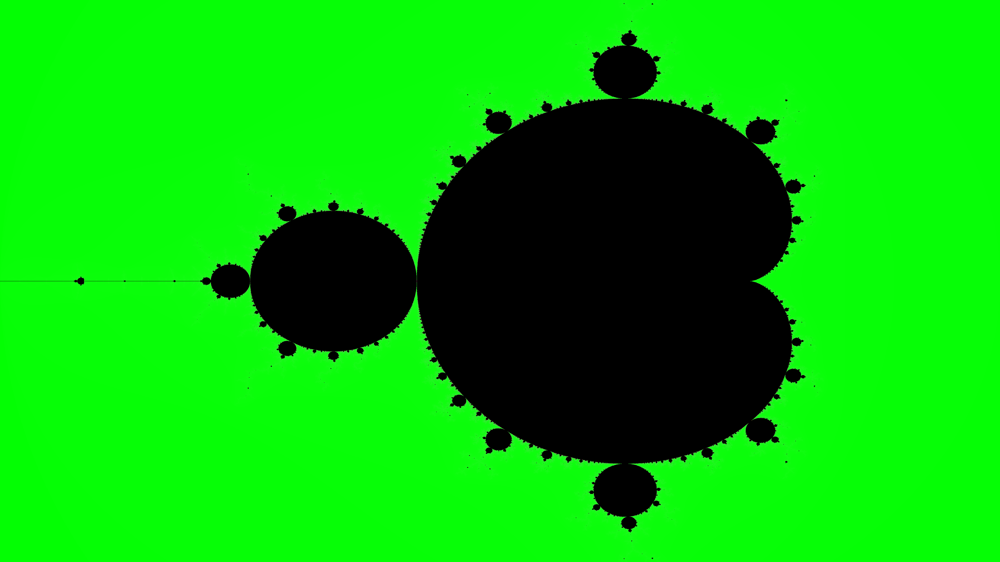
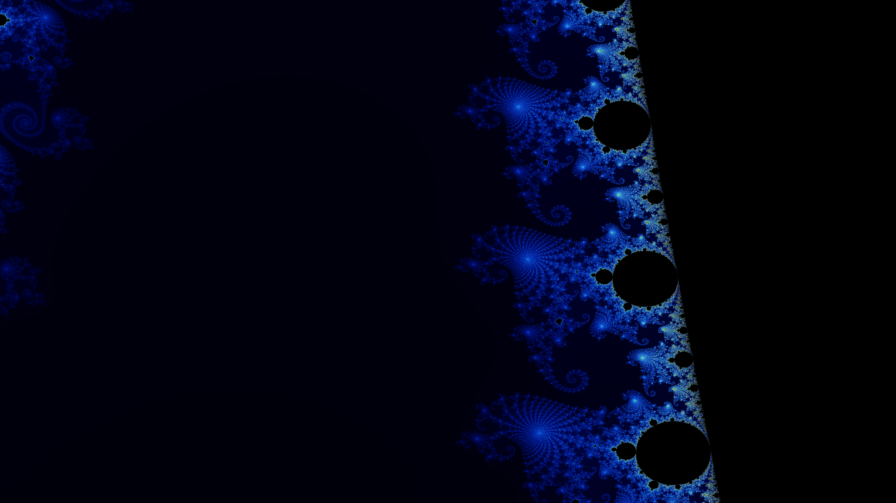

## Mandelbrot Set Generator

This project generates high-resolution images of the Mandelbrot set. It leverages multi-threading via the `rayon` crate for parallel computation, making the generation of large images fast and efficient. You can customize the image resolution, zoom level, and location in the complex plane.

### Features
- **Multi-threaded computation** using the `rayon` crate for fast Mandelbrot set generation.
- **Customizable image resolution**
- **Zoom functionality** to explore different parts of the Mandelbrot set.
- **Color gradients** to produce visually appealing fractal images.

### How It Works
The Mandelbrot set is a complex mathematical object defined by iterating the function:
```math
z_{n+1} = z_n^2 + c
```
where \( c \) is a complex number. A point is part of the Mandelbrot set if the sequence does not diverge to infinity. This program generates an image by iterating this function for every point on the complex plane, mapping it to a pixel on the screen.

### Running the Project

#### Prerequisites
Ensure that you have [Rust](https://www.rust-lang.org/tools/install) installed on your system.

#### Installation
1. Clone this repository:
   ```bash
   git clone https://github.com/surajk-m/mandelbrot_set.git
   cd mandelbrot_set
   ```

2. Build the project:
   ```bash
   cargo build --release
   ```

3. Run the project:
   ```bash
   cargo run
   ```

#### Customize the Parameters
You can customize the following parameters in `main.rs`:
- **Image resolution** (`width`, `height`): Modify the image resolution for higher or lower quality output.
- **Max iterations** (`max_iter`): Controls how many iterations are used for each point in the complex plane. Higher values produce more detail.
- **Zoom level** (`zoom`): Zoom in to explore the fractal in more detail.
- **Center coordinates** (`center_x`, `center_y`): Specify the coordinates to zoom in on.

Example:
```rust
let width = 15360;      // 16K resolution width
let height = 8640;      // 16K resolution height
let max_iter = 10000;   // Increased iterations for more detail
let center_x = -0.75;
let center_y = 0.1;
let zoom = 100.0;       // Zoom into the fractal
```

#### Generated Images
Below are some generated image examples :

##### 1. Standard Mandelbrot Set


#### 2. Zoomed into \(x = -0.75\), \(y = 0.1\), 100x Zoom


### License
This project is licensed under the MIT License. See the [LICENSE](LICENSE) file for details.

### Contributions
Feel free to open issues or pull requests for improvements or new features.

---

Happy exploring the fractal world!
